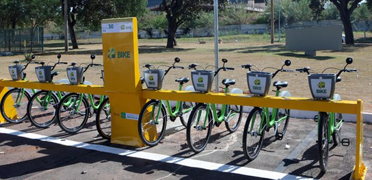
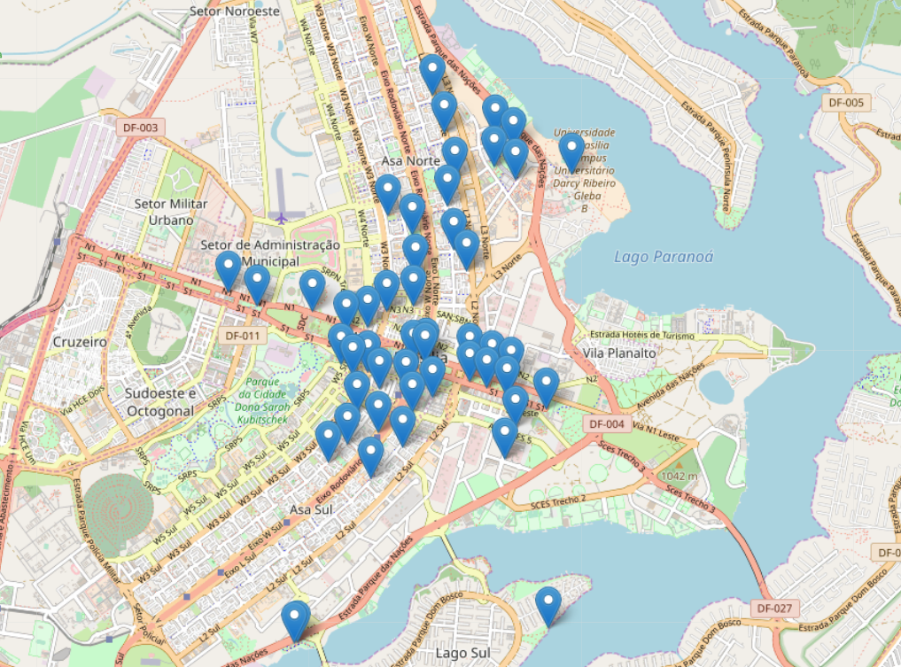
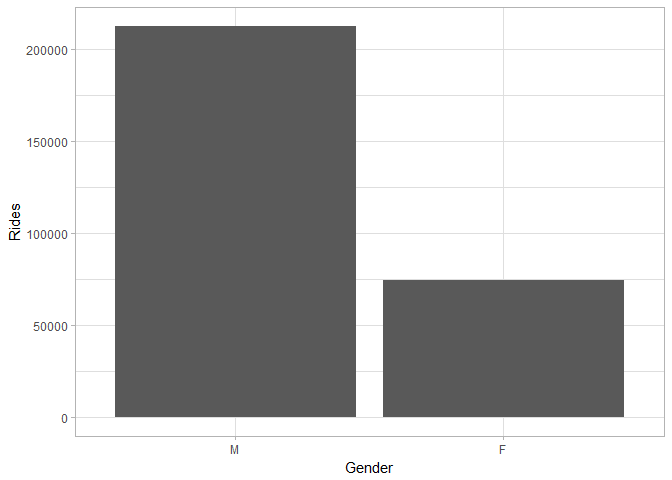
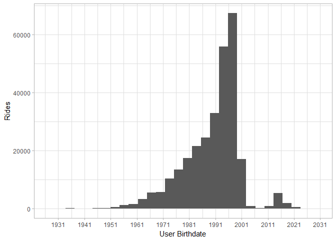
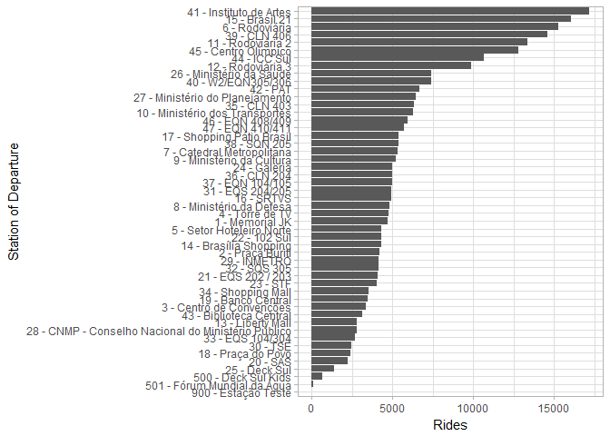

Data Analysis - Bike Sharing System in Brasília, Brazil.
========================================================

This repository is open-source, has academical purposes and consists of
analyzing the data from the Bike Sharing System of Brasília, more
commonly known as [+Bike](http://maisbikecompartilhada.com.br/).

The +Bike system was implemented on 2014 and is composed of 50 stations
along the central area of Brasília.

The original data can be found and downloaded via this
[link](http://www.dados.df.gov.br/dataset/viagens-feitas-com-o-sistema-de-bicicletas-compartilhadas-do-distrito-federal).

From the link above, it's possible to download the data in format
*.ods*, separated by months. But if you want to save time, you can find
the complete dataset in format *.csv* in the file
[**rawdata\_bikedf.csv**](data/rawdata_bikedf.csv).

About the data
--------------

The file [**data\_cleaning.R**](R%20scripts/data_cleaning.R) makes the
raw dataset tidy by cleaning wrong data input, parsing the correct type
for the variables and creating new useful variables.

The dataset generated by this script is the
[**df\_rides.csv**](data/df_rides.csv), which I recommend to use if you
want to go straight to the data analysis.

    glimpse(df_rides)

    ## Observations: 287,322
    ## Variables: 10
    ## $ user_gender    <fct> M, M, M, M, M, M, M, M, M, M, M, M, F, M, F, M,...
    ## $ user_birthdate <date> 1971-06-08, 1989-02-11, 1968-07-19, 1991-12-19...
    ## $ user_residence <chr> NA, "DF", NA, NA, "DF", NA, NA, "DF", NA, NA, "...
    ## $ ride_date      <date> 2018-01-01, 2018-01-01, 2018-01-01, 2018-01-01...
    ## $ time_start     <time> 06:05:18, 06:27:01, 06:29:33, 06:53:53, 06:58:...
    ## $ time_end       <time> 06:21:33, 06:32:17, 06:44:57, 06:59:45, 17:40:...
    ## $ station_start  <chr> "11 - Rodoviária 2", "26 - Ministério da Saude"...
    ## $ station_end    <chr> "41 - Instituto de Artes", "28 - CNMP - Conselh...
    ## $ ride_duration  <dbl> 16.250000, 5.266667, 15.400000, 5.866667, 641.1...
    ## $ ride_late      <dbl> 0, 0, 0, 0, 1, 0, 0, 0, 0, 0, 0, 0, 0, 0, 1, 0,...

Moreover, the cleaning process also generates a new dataset,
[**df\_stations.csv**](data/df_stations.csv), which contains the
information about the stations, including their respective geolocations.

    glimpse(df_stations)

    ## Observations: 49
    ## Variables: 5
    ## $ station        <chr> "1 - Memorial JK", "2 - Praça Buriti", "3 - Cen...
    ## $ station_number <int> 1, 2, 3, 4, 5, 6, 7, 8, 9, 10, 11, 12, 13, 14, ...
    ## $ station_name   <chr> " Memorial JK", " Praça Buriti", " Centro de Co...
    ## $ lat            <dbl> -15.78348, -15.78565, -15.78641, -15.78958, -15...
    ## $ lon            <dbl> -47.91337, -47.90875, -47.89986, -47.89431, -47...

An overview of the rides
------------------------

The file [**eda.R**](R%20scripts/eda.R) contains the script used for the
Exploratory Data Analysis, including the codes for the data
visualization below.

### User Gender

### User Birthdate

### Station of Departure

